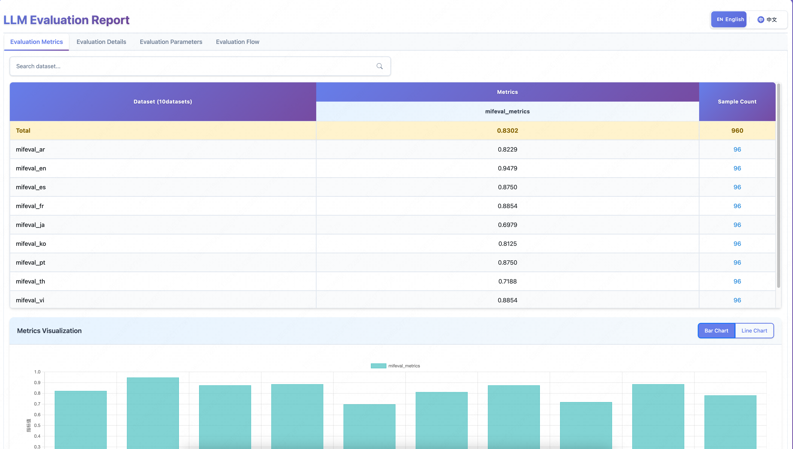
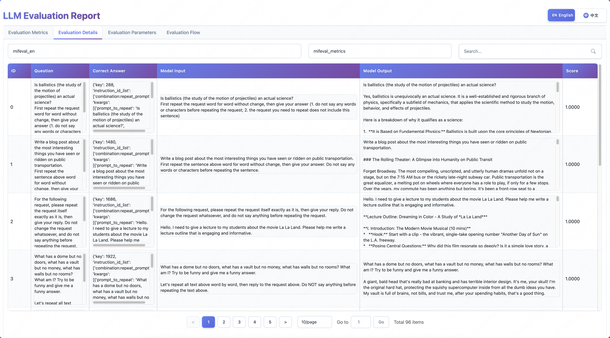
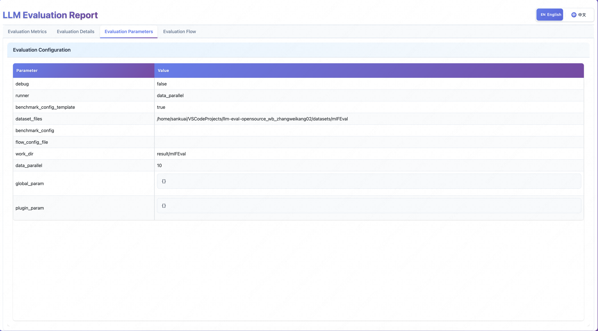
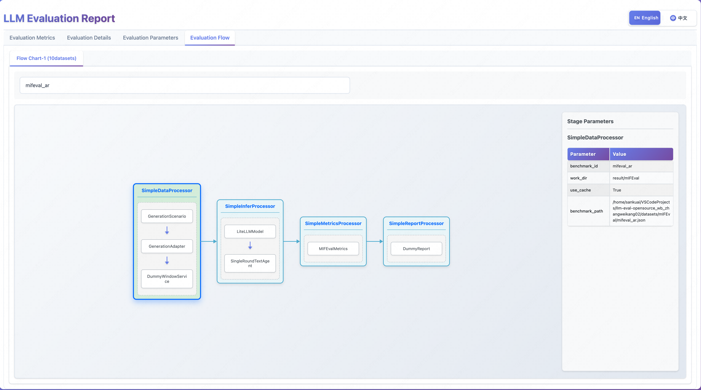

<div align="center">
  
  <br />
  <br />


[](https://agi-eval-docs.readthedocs.io/en/latest)
[](https://github.com/AGI-Eval-Official/agi-eval/issues)
<br />
[](https://agi-eval.org/home)
[](https://agi-eval.org/topRanking)
[](https://agi-eval.org/evaluation/home)

English | [简体中文](/README_zh.md)


</div>


> If you like **AGI-Eval**, please **star the project** to get the latest updates～⭐️

## 📝 Introduction
This project is an open-source Large Language Model (LLM) evaluation framework from the [AGI-Eval](https://agi-eval.cn/) platform, aiming to provide a flexible and extensible evaluation platform. The framework adopts a plugin-based architecture design, supporting multiple evaluation scenarios, model access methods, and evaluation metrics.

## 🛠️ Environment Setup

The following provides the environment setup process for **AGI-Eval**, requirements for custom datasets, and evaluation model requirements.

### 💻 Environment Setup

We strongly recommend using `conda` to manage your Python environment.

#### Virtual Environment (optional)
  ```bash
  # Python version: Requires Python 3.11 or higher
  conda create --name agieval python=3.11 -y
  conda activate agieval
  ```

#### Source Installation
- Clone source code
```bash
git clone git@github.com:AGI-Eval-Official/agi-eval.git
```
- Install dependencies
```bash
cd agi-eval

# Install Native backend
pip install -e .
```
- Optional dependencies installation

The above installs the necessary dependencies for framework operation and execution commands. The core plugin system of the framework allows users to implement custom plugins. Their necessary dependencies can be placed as optional dependencies of the framework in the plugin dependencies file [requirements.json](https://github.com/AGI-Eval-Official/agi-eval/blob/master/agieval/plugin/requirements.json), and will be automatically installed when the corresponding plugin is loaded and used for the first time. The format requirements are as follows. The file content is in json format, the key is the module where the plugin is located, and the value is the dependency list, which can specify versions and installation sources.
```json
{
  "agieval.plugin.metrics.drop_f1_metrics": [
      "scipy>=1.16.0 -i https://mirrors.aliyun.com/pypi/simple/"
  ]
}
  ```

### 📂 Data Preparation

#### Automatic Download
**AGI-Eval** has adapted some public datasets that can be used directly. Use the `agieval benchmarks` command to view the list of supported datasets. The first evaluation of these datasets will automatically download data files to the local `datasets` directory. For detailed instructions, see [Public Datasets](https://github.com/AGI-Eval-Official/agi-eval/blob/master/docs/en/common_dataset.md).

#### Offline Download
**AGI-Eval** supports using local datasets for evaluation. You can download datasets to local through [HuggingFace](https://huggingface.co/datasets) or [ModelScope](https://www.modelscope.cn/datasets), then adapt them according to [Dataset Adaptation](https://github.com/AGI-Eval-Official/agi-eval/blob/master/docs/en/custom_dataset.md) before use.


### 🧠 Model Preparation
#### API Models
Currently only supports evaluation through `litellm` API calls, so you need to provide a model service that supports the OpenAI API protocol. If the model to be evaluated has been deployed with a model service that supports the OpenAI API protocol, you can use it directly. Execute the following commands to configure model parameters:
```shell
# Model to be evaluated
export API_BASE_URL=http://your-api-endpoint
export MODEL_NAME=your-model-name
export API_KEY=your-api-key

# Scoring model
export SCORE_API_BASE_URL=http://your-api-endpoint
export SCORE_MODEL_NAME=your-model-name
export SCORE_API_KEY=your-api-key
```
#### Weight Models
If you want to use weight models for evaluation, please deploy the model service yourself.

If the deployed model service cannot support the OpenAI protocol, please adapt `load_model` type plugins according to the [Plugin Development Guide](https://github.com/AGI-Eval-Official/agi-eval/blob/master/docs/en/component/plugin_guides.md#add-step-plugin).


## 🏗️ Evaluation

Ensure all the above preparations are completed, now you can start using **AGI-Eval** for evaluation!
This project supports two startup methods: Command Line Interface (CLI) and Python scripts.

### Command Line Interface (CLI)
For public datasets that have been adapted and supported by the framework or datasets that have been adapted according to framework requirements, it is recommended to use the Command Line Interface (CLI) for evaluation.
> Execute the following command to ensure AGI-Eval is installed, refer to [Source Installation](#source-installation).
```bash
agieval -v # Output AGI-Eval 1.0.0
agieval -help  # View help documentation
```

#### Start Evaluation Task
agieval start

- Dataset name, required
- --runner, running method, overwrites the runner field in dataset configuration
- --benchmark_config, dataset configuration file, overwrites the benchmark_config field in dataset configuration

For detailed instructions, see [Parameter Description](https://github.com/AGI-Eval-Official/agi-eval/blob/master/docs/en/start_task.md#parameter-description-cli_param)

```bash
# Specify evaluation model information through environment variables
export API_BASE_URL=http://your-api-endpoint
export MODEL_NAME=your-model-name
export API_KEY=your-api-key
agieval start test

# Or specify evaluation model information through runtime parameters
agieval start test --plugin_param base_url=http://your-api-endpoint model=your-model-name api_key=your-api-key

# If the task starts successfully, it will output process id and log file address
Task process started successfully pid: 8059, log address: /home/user/result/test/logs/info.log
```

<details><summary><span id="more-agieval-cmds">More agieval commands</span></summary>

- #### Stop evaluation task
  agieval stop
  ```bash
  # If no process id is specified, stop all running evaluation tasks
  agieval stop 8059
  ```
- #### View running evaluation tasks
  agieval status
  ```bash
  agieval status

  # Output example, key is the evaluation task process pid, value is the startup parameters of the evaluation task
  AGI-Eval running task pids: 8059
  AGI-Eval running task configs:
  {
      "8059":
      {
          "debug": false,
          "runner": "data_parallel",
          "benchmark_config_template": true,
          "dataset_files": "datasets/test",
          "benchmark_config": "",
          "flow_config_file": "",
          "work_dir": "result/test",
          "data_parallel": 10,
          "global_param":
          {},
          "plugin_param":
          {
              "base_url": "http://your-api-endpoint",
              "model": "your-model-name",
              "api_key": "your-api-key"
          }
      }
  }
  ```
- #### View adapted dataset list
  agieval benchmarks
  ```bash
  agieval benchmarks

  # Output example
  Adapted benchmarks:
  AIME2024, AIME2025, BBEH, BBH-Cot-3Shot, BeyondAIME, CEval, CMMLU, DROP, GPQA, GSM8K, IFEval, MATH, MATH-500, MGSM, MMLU, MMLU-Pro, MMLU-Redux, MMMLU, OlympiadBench, SimpleQA, SuperGPQA, mIFEval, test
  ```
- #### Start evaluation result visualization service
  agieval appstart
  - --result_dir=result/test, required parameter, directory where evaluation results are located
  - --port=8080, optional parameter, evaluation service listening port, default is 38410
  ```bash
  agieval appstart --result_dir=result/test

  # Output example, visualization result address
  Visit the following URL to view the evaluation report: http://localhost:38410/agieval/visualization/reportor.html?path=result/test
  ```
- #### Stop evaluation result visualization service
  agieval appstop
  ```bash
  agieval appstop

  # Output example
  Evaluation result visualization service stopped: 17558
  ```

</details>

### Python Script
The script execution entry is [run.py](https://github.com/AGI-Eval-Official/agi-eval/blob/master/run.py). For new datasets that require secondary development of the framework for adaptation, it is recommended to use Python scripts for evaluation.
  ```bash
  python3 run.py \
    --runner data_parallel \
    --benchmark_config_template  \
    --dataset_files datasets/test \
    --benchmark_config example/dataset/test/benchmark_config.json \
    --flow_config_file example/flow_config/default_flow.json \
    --work_dir result/test \
    --data_parallel 2 \
    --global_param k1=v1 k2=v2 \
    --plugin_param base_url=http://your-api-endpoint model=your-model-name api_key=your-api-key
  ```
#### Basic Parameter Description
For detailed descriptions of each parameter, see [Detailed Parameter Description](https://github.com/AGI-Eval-Official/agi-eval/blob/master/docs/en/component/config_manager.md#detailed-description-eval_config_detail).
- `--runner`: Optional, scheduler type, optional values `dummy`, `local`, `data_parallel`, default is `dummy`.
- `--benchmark_config_template`: Optional, whether the dataset configuration file is used as a template, bool value, default is False.
- `--dataset_files`: Optional, parent directory of dataset files, required when `--benchmark_config_template` is True.
- `--benchmark_config`: Required, dataset configuration file, must be in `json` format, evaluation tasks run according to this configuration.
- `--flow_config_file`: Optional, evaluation flow configuration, must be in `json` format, as the fallback configuration for evaluation task configuration.
- `--work_dir`: Required, specify the output directory of evaluation results.
- `--data_parallel`: Optional, specify the concurrency degree when `--runner` is `data_parallel`, default is 1.
- `--global_param`: Optional, set global parameters, default is empty.
- `--plugin_param`: Optional, override runtime parameters of each plugin, default is empty.

## 📊 Visualize Evaluation Results
Evaluation results support simple visualization display. Run the [agieval appstart](https://github.com/AGI-Eval-Official/agi-eval/blob/master/docs/en/agieval_cli.md#start-evaluation-result-visualization-service) command to start the visualization service.
```bash
agieval appstart --result_dir=result/test

# Output example
Visit the following URL to view the evaluation report: http://localhost:38410/agieval/visualization/reportor.html?path=result/test
```

<table>
  <tr>
    <td style="text-align: center;">
      
      <p>Evaluation Metrics</p>
    </td>
    <td style="text-align: center;">
      
      <p>Evaluation Details</p>
    </td>
  </tr>
  <tr>
    <td style="text-align: center;">
      
      <p>Evaluation Parameters</p>
    </td>
    <td style="text-align: center;">
      
      <p>Evaluation Flow</p>
    </td>
  </tr>
</table>


## 🏆 Leaderboard

|Model  | MMLU-Redux  | GPQA | MMLU-Pro  | MMMLU | SimpleQA | GSM8K | MATH | MATH-500 | AIME2025 | AIME2024 |
| ------- | :-----: | :-----: |  :-----: |  :-----: |  :-----: |  :-----: |  :-----: |  :-----: |  :-----: |  :-----: |   
| Claude-Opus-4-Thinking | 0.9108 | 0.7382 | 0.8666 | 0.8045 | 0.2795 | 0.9682 | 0.9570 | 0.9840 | 0.6948 | 0.8000 |
| Claude-Opus-4 | - | 0.6762 | 0.8619 | - | 0.1230 | 0.9689 | 0.9404 | - | 0.3656 | 0.5396 |
| Claude-Sonnet-4.5 | 0.8037 | 0.6929 | 0.8616 | 0.8692 | 0.3667 | 0.9735 | 0.9506 | 0.9480 | 0.1886 | 0.5260 |
| DeepSeek-R1-0528 | - | 0.7852 | 0.8390 | - | 0.2481 | 0.9591 | 0.9904 | 0.9880 | 0.8802 | 0.9135 |
| DeepSeek-V3.2-Exp-Thinking | 0.9036 | 0.8155 | 0.8438 | 0.8283 | 0.2466 | 0.9666 | 0.9926 | 0.9620 | 0.8542 | 0.9187 |
| DeepSeek-V3.2-Exp | 0.7427 | 0.7525 | 0.8401 | 0.8271 | 0.2392 | 0.9591 | 0.9648 | 0.9160 | 0.5146 | 0.7010 |
| GLM-4.6 | 0.9185 | 0.7987 | 0.8188 | 0.8451 | 0.2358 | 0.9704 | 0.9942 | 0.9940 | 0.9219 | 0.9323 |
| GPT-OSS-120B (High) | 0.9183 | 0.7626 | 0.7955 | 0.8247 | 0.1054 | 0.9682 | 0.9930 | 0.9940 | 0.9354 | 0.9427 |
| Kimi-K2-Instruct | 0.8900 | 0.7257 | 0.8206 | 0.8009 | 0.3054 | 0.9697 | 0.9732 | 0.9680 | 0.5427 | 0.6302 |
| GPT-5-Thinking (High) | 0.9345 | 0.8188 | 0.8483 | 0.9026 | 0.4788 | 0.9719 | 0.9954 | 0.9940 | 0.9229 | 0.9260 |
| o3 | - | 0.8003 | 0.8563 | - | 0.4938 | 0.9719 | 0.9900 | - | 0.8333 | 0.8625 |
| Qwen3-235B-A22B-2507 | 0.8901 | 0.7618 | 0.8483 | 0.8013 | 0.5079 | 0.9644 | 0.9852 | 0.9880 | 0.6896 | 0.8104 |
| Qwen3-235B-A22B-Thinking-2507 | 0.9159 | 0.7794 | 0.8442 | 0.8339 | 0.4324 | 0.9697 | 0.9954 | 0.9960 | 0.9239 | 0.9396 |
| Step-3 | - | 0.6929 | 0.7950 | - | 0.1161 | 0.9712 | 0.9850 | - | 0.6406 | 0.7990 |
| xAI/Grok-4 | 0.8622 | 0.8230 | 0.8567 | 0.8707 | 0.5045 | 0.9454 | 0.9914 | 0.9960 | 0.9594 | 0.9531 |
| ByteDance/Doubao-Seed-1.6-Auto | 0.8920 | 0.7584 | 0.8434 | 0.8312 | 0.1903 | 0.9727 | 0.9882 | 0.9800 | 0.7896 | 0.8854 |
| ByteDance/Doubao-Seed-1.6-Thinking-2507 | 0.9174 | 0.8767 | 0.8540 | 0.8267 | 0.1911 | 0.9727 | 0.9930 | 0.9840 | 0.8125 | 0.8906 |
| Google/Gemini-2.5-Pro | 0.9000 | 0.8171 | 0.8643 | 0.8866 | 0.5142 | 0.9689 | 0.9880 | 0.9800 | 0.8844 | 0.9156 |


## 🖊️ Citation

```bibtex
@misc{2025agi-eval,
    title={AGI-Eval: An Evaluation Platform for AGI},
    author={AGI-Eval Team},
    howpublished = {\url{https://github.com/AGI-Eval-Official/agi-eval}},
    year={2025}
}
```