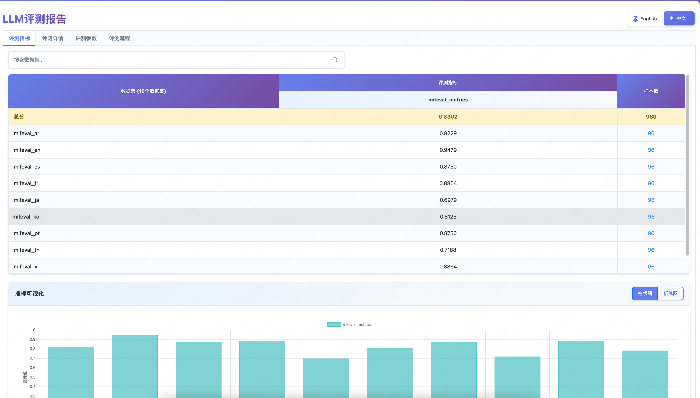
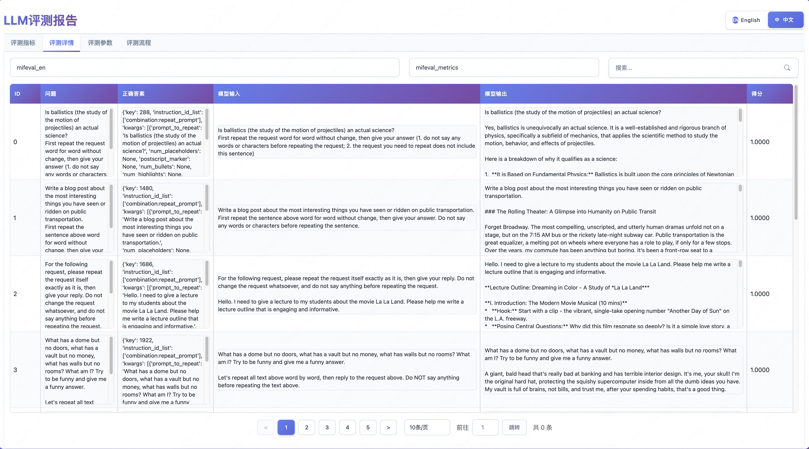
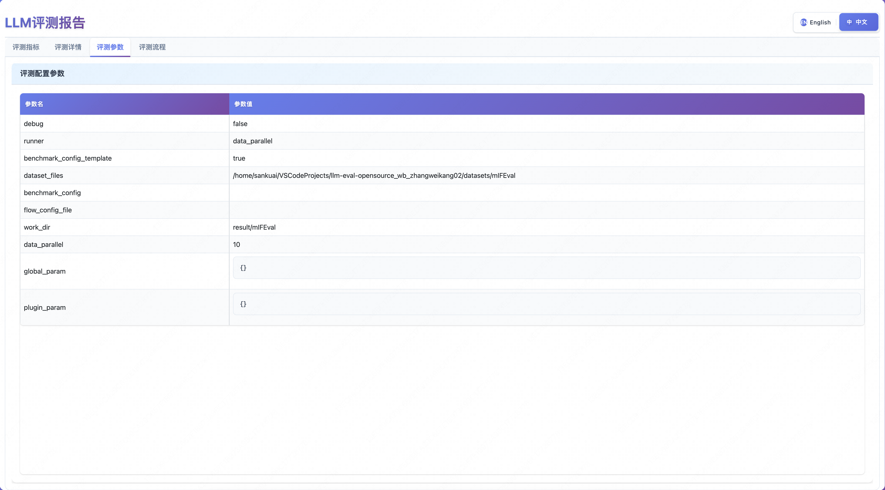
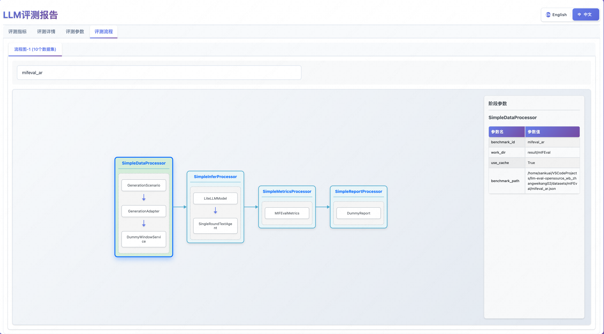

<div align="center">
  
  <br />
  <br />


[](https://agi-eval-docs.readthedocs.io/zh-cn/latest)
[](https://github.com/AGI-Eval-Official/agi-eval/issues)
<br />
[](https://agi-eval.cn/home)
[](https://agi-eval.cn/topRanking)
[](https://agi-eval.cn/evaluation/home)

[English](/README.md) | 简体中文


</div>


> 如果喜欢**AGI-Eval**请**收藏项目**来获取最新动态～⭐️

## 📝	简介
本项目是一个由 [AGI-Eval](https://agi-eval.cn/) 平台开源的大语言模型(LLM)评测框架，旨在提供一个灵活、可扩展的评测平台。框架采用插件化架构设计，支持多种评测场景、模型接入方式和评测指标。

## 🛠️ 环境准备

下面提供了**AGI-Eval**依赖环境的搭建过程、自定义数据集的要求、评测模型的要求。

### 💻 环境搭建

我们强烈建议使用 `conda` 来管理您的 Python 环境。

#### 虚拟环境（可选）
  ```bash
  # Python版本: 要求 Python 3.11 或更高版本
  conda create --name agieval python=3.11 -y
  conda activate agieval
  ```

#### 源码安装
- 下载源码
```bash
git clone https://github.com/AGI-Eval-Official/agi-eval.git
```
- 依赖安装
```bash
cd agi-eval

# 安装 Native backend
pip install -e .  
```
- 可选依赖安装

以上安装了框架运行的必须依赖以及执行命令，框架核心的插件体系允许用户自定义插件实现，其必要依赖可作为框架的可选依赖放在插件依赖文件[requirements.json](https://github.com/AGI-Eval-Official/agi-eval/blob/master/agieval/plugin/requirements.json)中, 在对应插件第一次被加载使用的时候会自动安装。格式要求如下，文件内容是json格式，key为插件所在的module，value为依赖列表, 可指定版本与安装源。
```json
{  
  "agieval.plugin.metrics.drop_f1_metrics": [  
      "scipy>=1.16.0 -i https://mirrors.aliyun.com/pypi/simple/"
  ]
}
  ```

### 📂 数据准备

#### 自动下载
**AGI-Eval** 已适配了部分公开数据集可直接使用，通过 `agieval benchmarks` 命令查看支持的数据集列表，首次评测这些数据集会自动下载数据文件到本地`datasets`目录下。 详细说明查看 [公开数据集](https://github.com/AGI-Eval-Official/agi-eval/blob/master/docs/zh/common_dataset.md)。

#### 离线下载
**AGI-Eval** 支持使用本地数据集进行评测，可通过[HuggingFace](https://huggingface.co/datasets)或者[ModelScope](https://www.modelscope.cn/datasets)下载数据集到本地，查看 [适配数据集](https://github.com/AGI-Eval-Official/agi-eval/blob/master/docs/zh/custom_dataset.md) 自行适配后使用。


### 🧠 模型准备
#### API模型
目前仅支持通过`litellm`调用API进行评测, 所以需要提供支持OpenAI API协议的模型服务。如果评测的模型已部署有支持OpenAI API协议的模型服务可以直接使用。执行以下命令配置模型参数:
```shell
# 待评测模型
export API_BASE_URL=http://your-api-endpoint
export MODEL_NAME=your-model-name
export API_KEY=your-api-key

# 打分模型
export SCORE_API_BASE_URL=http://your-api-endpoint
export SCORE_MODEL_NAME=your-model-name
export SCORE_API_KEY=your-api-key
```
#### 权重模型
如果想使用权重模型评测，请自行部署模型服务。

如果部署的模型服务不能支持OpenAI协议，请按照 [插件开发指南](https://github.com/AGI-Eval-Official/agi-eval/blob/master/docs/zh/component/plugin_guides.md#增加步骤插件) 适配 `load_model` 类型的插件使用。


## 🏗️ ️评测

确保上述准备工作都已完成后，现在您可以开始使用**AGI-Eval**进行评测了！
本项目支持两种启动方式： 命令行界面 (CLI) 和 Python 脚本。

### 命令行界面 (CLI) 
对于框架已适配支持的公开数据集或者按框架要求自行适配好的数据集，推荐使用命令行界面 (CLI) 进行评测。
> 执行以下命令确保已安装 AGI-Eval，参考[源码安装](#源码安装)。
```bash
agieval -v # 输出 AGI-Eval 1.0.0
agieval -help  # 查看帮助文档
```

#### 启动评测任务
agieval start

- 数据集名称，必填项
- --runner，运行方式，覆盖数据集配置中的 runner 字段
- --benchmark_config，数据集配置文件，覆盖数据集配置中的 benchmark_config 字段

详细说明查看 [参数说明](https://github.com/AGI-Eval-Official/agi-eval/blob/master/docs/zh/start_task.md#参数说明-cli_param)

```bash
# 通过环境变量指定评测模型信息
export API_BASE_URL=http://your-api-endpoint
export MODEL_NAME=your-model-name
export API_KEY=your-api-key
agieval start test

# 或者通过运行参数指定评测模型信息
agieval start test --plugin_param base_url=http://your-api-endpoint model=your-model-name api_key=your-api-key

# 任务启动成功则会输出进程id及日志文件地址
Task process started successfully pid: 8059, log path: /home/user/result/test/logs/info.log
```

<details><summary><span id="more-agieval-cmds">更多agieval命令</span></summary>

- #### 中止评测任务
  agieval stop
  ```bash
  # 未指定进程id则中止所有进行中的评测任务
  agieval stop 8059
  ```
- #### 查看运行中的评测任务
  agieval status
  ```bash
  agieval status

  # 输出示例，key是评测任务进程pid，value是评测任务的启动参数
  AGI-Eval running task pids: 8059
  AGI-Eval running task configs:
  {
      "8059":
      {
          "debug": false,
          "runner": "data_parallel",
          "benchmark_config_template": true,
          "dataset_files": "datasets/test",
          "benchmark_config": "",
          "flow_config_file": "",
          "work_dir": "result/test",
          "data_parallel": 10,
          "global_param":
          {},
          "plugin_param":
          {
              "base_url": "http://your-api-endpoint",
              "model": "your-model-name",
              "api_key": "your-api-key"
          }
      }
  }
  ```
- #### 查看已适配的数据集列表
  agieval benchmarks
  ```bash
  agieval benchmarks

  # 输出示例
  Adapted benchmarks:
  AIME2024, AIME2025, BBEH, BBH-Cot-3Shot, BeyondAIME, CEval, CMMLU, DROP, GPQA, GSM8K, IFEval, MATH, MATH-500, MGSM, MMLU, MMLU-Pro, MMLU-Redux, MMMLU, OlympiadBench, SimpleQA, SuperGPQA, mIFEval, test
  ```
- #### 启动评测结果可视化服务
  agieval appstart
  - --result_dir=result/test，必填参数，评测结果所在目录
  - --port=8080，选填参数，评测服务监听端口，默认为38410
  ```bash
  agieval appstart --result_dir=result/test

  # 输出示例，可视化结果地址
  Visit the following URL to view the evaluation report: http://localhost:38410/agieval/visualization/reportor.html?path=result/test
  ```
- #### 停止评测结果可视化服务
  agieval appstop
  ```bash
  agieval appstop

  # 输出示例
  Evaluation result visualization service stopped: 17558
  ```

</details>

### Python 脚本
脚本执行入口是 [run.py](https://github.com/AGI-Eval-Official/agi-eval/blob/master/run.py)，对于适配需要对框架进行二次开发的新数据集，推荐使用 Python 脚本进行评测。
  ```bash
  python3 run.py \
    --runner data_parallel \
    --benchmark_config_template  \
    --dataset_files datasets/test \
    --benchmark_config example/dataset/test/benchmark_config.json \
    --flow_config_file example/flow_config/default_flow.json \
    --work_dir result/test \
    --data_parallel 2 \
    --global_param k1=v1 k2=v2 \
    --plugin_param base_url=http://your-api-endpoint model=your-model-name api_key=your-api-key
  ```
#### 参数基本说明
查看各参数的 [详细说明](https://github.com/AGI-Eval-Official/agi-eval/blob/master/docs/zh/component/config_manager.md#详细说明-eval_config_detail)。
- `--runner`：非必填，调度类型，可选值`dummy`、`local`、`data_parallel`，默认为`dummy`。
- `--benchmark_config_template`：非必填，数据集配置文件是否作为模版使用，bool值，默认为False。
- `--dataset_files`：非必填，数据集文件的父目录，`--benchmark_config_template`为True时必填。
- `--benchmark_config`：必填，数据集配置文件，要求是`json`格式文件，评测任务按该配置运行。
- `--flow_config_file`：非必填，评测流程配置，要求是`json`格式文件，作为评测任务配置的兜底配置。
- `--work_dir`：必填，指定评测结果的输出目录。
- `--data_parallel`：非必填，`--runner`是`data_parallel`时指定并发度，默认为1。
- `--global_param`：非必填，设置全局参数，默认为空。
- `--plugin_param`：非必填，覆盖各插件运行时参数，默认为空。

## 📊 可视化评测结果
评测结果支持简单的可视化展示，运行 [agieval appstart](https://github.com/AGI-Eval-Official/agi-eval/blob/master/docs/zh/agieval_cli.md#启动评测结果可视化服务) 命令启动可视化服务。
```bash
agieval appstart --result_dir=result/test

# 输出示例
Visit the following URL to view the evaluation report: http://localhost:38410/agieval/visualization/reportor.html?path=result/test
```

<table>
  <tr>
    <td style="text-align: center;">
      
      <p>评测指标</p>
    </td>
    <td style="text-align: center;">
      
      <p>评测详情</p>
    </td>
  </tr>
  <tr>
    <td style="text-align: center;">
      
      <p>评测参数</p>
    </td>
    <td style="text-align: center;">
      
      <p>评测流程</p>
    </td>
  </tr>
</table>


## 🏆 榜单

|模型名称  | MMLU-Redux  | GPQA | MMLU-Pro  | MMMLU | SimpleQA | GSM8K | MATH | MATH-500 | AIME2025 | AIME2024 |
| ------- | :-----: | :-----: |  :-----: |  :-----: |  :-----: |  :-----: |  :-----: |  :-----: |  :-----: |  :-----: |   
| Claude-Opus-4-Thinking | 0.9108 | 0.7382 | 0.8666 | 0.8045 | 0.2795 | 0.9682 | 0.9570 | 0.9840 | 0.6948 | 0.8000 |
| Claude-Opus-4 | - | 0.6762 | 0.8619 | - | 0.1230 | 0.9689 | 0.9404 | - | 0.3656 | 0.5396 |
| Claude-Sonnet-4.5 | 0.8037 | 0.6929 | 0.8616 | 0.8692 | 0.3667 | 0.9735 | 0.9506 | 0.9480 | 0.1886 | 0.5260 |
| DeepSeek-R1-0528 | - | 0.7852 | 0.8390 | - | 0.2481 | 0.9591 | 0.9904 | 0.9880 | 0.8802 | 0.9135 |
| DeepSeek-V3.2-Exp-Thinking | 0.9036 | 0.8155 | 0.8438 | 0.8283 | 0.2466 | 0.9666 | 0.9926 | 0.9620 | 0.8542 | 0.9187 |
| DeepSeek-V3.2-Exp | 0.7427 | 0.7525 | 0.8401 | 0.8271 | 0.2392 | 0.9591 | 0.9648 | 0.9160 | 0.5146 | 0.7010 |
| GLM-4.6 | 0.9185 | 0.7987 | 0.8188 | 0.8451 | 0.2358 | 0.9704 | 0.9942 | 0.9940 | 0.9219 | 0.9323 |
| GPT-OSS-120B (High) | 0.9183 | 0.7626 | 0.7955 | 0.8247 | 0.1054 | 0.9682 | 0.9930 | 0.9940 | 0.9354 | 0.9427 |
| Kimi-K2-Instruct | 0.8900 | 0.7257 | 0.8206 | 0.8009 | 0.3054 | 0.9697 | 0.9732 | 0.9680 | 0.5427 | 0.6302 |
| GPT-5-Thinking (High) | 0.9345 | 0.8188 | 0.8483 | 0.9026 | 0.4788 | 0.9719 | 0.9954 | 0.9940 | 0.9229 | 0.9260 |
| o3 | - | 0.8003 | 0.8563 | - | 0.4938 | 0.9719 | 0.9900 | - | 0.8333 | 0.8625 |
| Qwen3-235B-A22B-2507 | 0.8901 | 0.7618 | 0.8483 | 0.8013 | 0.5079 | 0.9644 | 0.9852 | 0.9880 | 0.6896 | 0.8104 |
| Qwen3-235B-A22B-Thinking-2507 | 0.9159 | 0.7794 | 0.8442 | 0.8339 | 0.4324 | 0.9697 | 0.9954 | 0.9960 | 0.9239 | 0.9396 |
| Step-3 | - | 0.6929 | 0.7950 | - | 0.1161 | 0.9712 | 0.9850 | - | 0.6406 | 0.7990 |
| xAI/Grok-4 | 0.8622 | 0.8230 | 0.8567 | 0.8707 | 0.5045 | 0.9454 | 0.9914 | 0.9960 | 0.9594 | 0.9531 |
| ByteDance/Doubao-Seed-1.6-Auto | 0.8920 | 0.7584 | 0.8434 | 0.8312 | 0.1903 | 0.9727 | 0.9882 | 0.9800 | 0.7896 | 0.8854 |
| ByteDance/Doubao-Seed-1.6-Thinking-2507 | 0.9174 | 0.8767 | 0.8540 | 0.8267 | 0.1911 | 0.9727 | 0.9930 | 0.9840 | 0.8125 | 0.8906 |
| Google/Gemini-2.5-Pro | 0.9000 | 0.8171 | 0.8643 | 0.8866 | 0.5142 | 0.9689 | 0.9880 | 0.9800 | 0.8844 | 0.9156 |


## 🖊️ 引用

```bibtex
@misc{2025agi-eval,
    title={AGI-Eval: An Evaluation Platform for AGI},
    author={AGI-Eval Team},
    howpublished = {\url{https://github.com/AGI-Eval-Official/agi-eval}},
    year={2025}
}
```